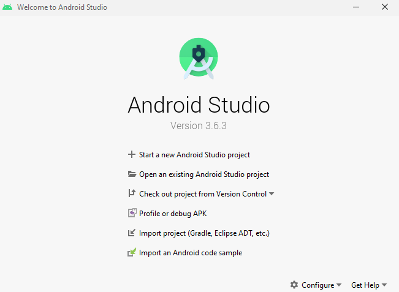
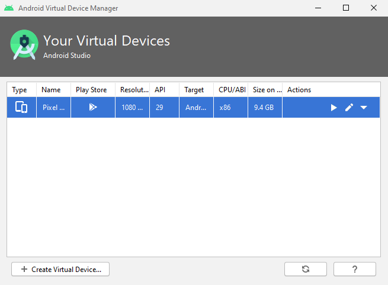

# Mobile Application for Forest Ecology Research 

  

---

### Table of Contents
You're sections headers will be used to reference location of destination.

- [Description](#description)
- [Installation](#installation)
- [License](#license)
- [Author Info](#authors)

---

## Description

Data collection app for the Pacific Northwest Permanent Sample Plot Program.

#### Technologies

- ODK-X
- JavaScript
- HTML
- CSS

[Back To The Top](#Mobile-Application-for-Forest-Ecology-Research)

---

<!--- ## How To Use --->

## Installation
#### Dependencies
1. Java Run Time Environment https://java.com/en/download/
2. Node.js https://nodejs.org/en/ 
3. Grunt
`npm install -g grunt-cli`
4. Android Studio https://developer.android.com/studio
5. Android Debug Bridge (ADB) https://developer.android.com/studio/releases/platform-tools
6. ODK-X app designer https://github.com/odk-x/app-designer/releases/tag/2.1.6

#### Install on Device 
You will need to install the following apps on your Android Device.
* OI File Manager
* ODK-X tables
* ODK-X services

https://docs.odk-x.org/basics-install/

If you do not have a physical device you can use the
Android Studio emulator.

1. Open Android Studio and press **configure** on the bottom right of the screen.

  

  
</p

4. If a device does not already exist, select **Create Device...** otherwise
select a device from the given options and start it. 
5. The rest of the instructions from here on will be the same if installing 
on a physical device.

#### Install Application 
1. Download project 
`git clone https://github.com/poliakosOSU/OSU_Capstone_MAFE.git`
2. Transfer files from app project repo to app-designer

   Copy the config file from 

   `OSU_Capstone_MAFE/odk_app/`

   and replace the config file in

   `app-designer-2.1.6/app/`

3. Enable Developer options on your Android Device
4. Connect Android Device to computer
5. Open your terminal and navigate to the root of the app-designer directory and run the following command

   `grunt adbpush`

#### Using Appllication
1. On your Android Device, open the previously installed ODK-X tables app
2. In the top right corner select the Preferences tab
3. Press the Reset Configuration Button
4. Go back to the home menu of the application, you can now use the app.

[Back To The Top](#Mobile-Application-for-Forest-Ecology-Research)

## License

MIT License

Copyright (c) [2020] [Sergei Poliakov and Joseph Landreville]

Permission is hereby granted, free of charge, to any person obtaining a copy
of this software and associated documentation files (the "Software"), to deal
in the Software without restriction, including without limitation the rights
to use, copy, modify, merge, publish, distribute, sublicense, and/or sell
copies of the Software, and to permit persons to whom the Software is
furnished to do so, subject to the following conditions:

The above copyright notice and this permission notice shall be included in all
copies or substantial portions of the Software.

THE SOFTWARE IS PROVIDED "AS IS", WITHOUT WARRANTY OF ANY KIND, EXPRESS OR
IMPLIED, INCLUDING BUT NOT LIMITED TO THE WARRANTIES OF MERCHANTABILITY,
FITNESS FOR A PARTICULAR PURPOSE AND NONINFRINGEMENT. IN NO EVENT SHALL THE
AUTHORS OR COPYRIGHT HOLDERS BE LIABLE FOR ANY CLAIM, DAMAGES OR OTHER
LIABILITY, WHETHER IN AN ACTION OF CONTRACT, TORT OR OTHERWISE, ARISING FROM,
OUT OF OR IN CONNECTION WITH THE SOFTWARE OR THE USE OR OTHER DEALINGS IN THE
SOFTWARE.

[Back To The Top](#Mobile-Application-for-Forest-Ecology-Research)

---

## Authors
- Sergei Poliakov
- Joseph Landreville

[Back To The Top](#Mobile-Application-for-Forest-Ecology-Research)
